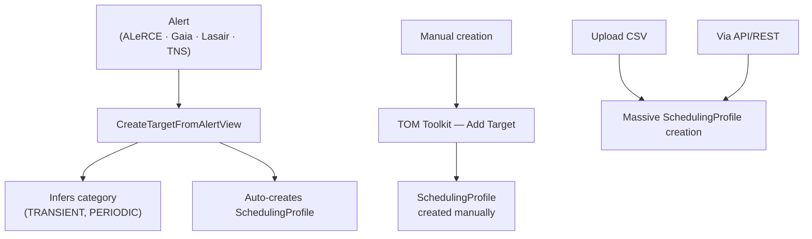
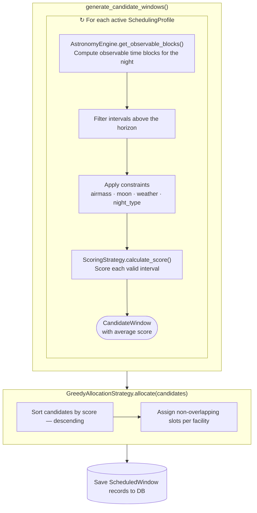

# Data Flow

The complete planning cycle follows these steps:

## 1. Target Ingestion

Targets can arrive through four paths:

## 2. Constraint Configuration

The astronomer configures the target's `SchedulingProfile`:

| Field | Description |
|-------|-------------|
| `facility` | Telescope to use |
| `category` | STANDARD / TRANSIENT / PERIODIC / NON-SIDEREAL |
| `min_altitude`, `max_airmass` | Observability constraints |
| `min_moon_distance`, `max_moon_illumination` | Lunar constraints |
| `min_seeing`, `transparency_type` | Sky quality constraints |
| `ObservationFrames` | Filters, exposures, dithering |
| `priority` | Urgency multiplier |

## 3. Scheduler Execution

When **Scheduler** is executed, `SchedulerCore` runs the following pipeline:

## 4. Visualisation

Once scheduling is complete, `TimelineView` loads the generated `ScheduledWindow` records and serves them to the frontend through three JSON endpoints:

| Endpoint | Description |
|---|---|
| `GET /scheduler/api/events/` | Scheduled windows for the FullCalendar view |
| `GET /scheduler/api/gantt/` | Observation distribution per facility across the night |
| `GET /scheduler/api/nightly/` | Tonight's targets with scores and visibility windows |

## 5. Export / Execution

Once the schedule is ready, two output paths are available:

- **CSV export** — Downloads a file with the complete schedule (target, start, end, score, frames).
- **ASCOM Controller** — Executes the sequence robotically, slewing the telescope at each scheduled time.
