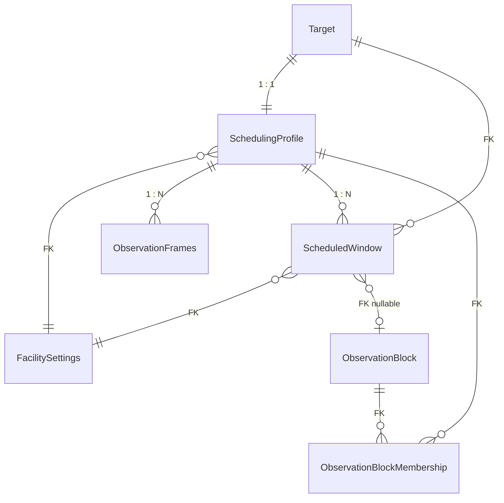

# Database Schema

## Scheduler Models

### Main relationships

### SchedulingProfile

| Field | Type | Default | Description |
|-------|------|---------|-------------|
| `target` | OneToOneField(Target) | — | Associated target |
| `category` | TextChoices | STANDARD | Target type (STANDARD/TRANSIENT/PERIODIC/NON-SIDEREAL) |
| `priority` | float | 1.0 | Urgency multiplier |
| `is_active` | boolean | True | Active in the scheduler |
| `facility` | FK(FacilitySettings) | null | Assigned telescope |
| `min_altitude` | float | 30° | Minimum observable altitude |
| `max_airmass` | float | 2.5 | Maximum airmass |
| `min_seeing` | float | 0.6" | Minimum required seeing |
| `min_moon_distance` | float | 20° | Minimum lunar separation |
| `max_moon_illumination` | float | 0.85 | Maximum lunar illumination [0,1] |
| `night_type` | choices | dark | Required night type (dark/gray/bright/dm) |
| `transparency_type` | choices | clear | Required transparency (photometric/clear/thin/thick/dm) |
| `transit_start` | datetime | null | Transit start (PERIODIC only) |
| `transit_end` | datetime | null | Transit end (PERIODIC only) |
| `fade_date` | datetime | null | Fade-out date (TRANSIENT only) |
| `non_sidereal_type` | choices | `""` | Subtype of non-sidereal object (PLANET/COMET/ASTEROID) |
| `min_solar_elongation` | float | 45.0 | Minimum sun separation |
| `last_scheduled` | datetime | null | Last time this target was scheduled |

### ObservationFrames

| Field | Type | Default | Description |
|-------|------|---------|-------------|
| `scheduling_profile` | FK(SchedulingProfile) | — | Parent profile |
| `filter_name` | CharField | — | Filter name (e.g. `R`, `Ha`, `OIII`) |
| `exposure_time` | float | 60s | Exposure duration in seconds |
| `repetitions` | integer | 1 | Number of exposures |
| `dithering_enabled` | boolean | False | Enable dithering |
| `ra_offset` | float | 0 | RA offset in arcsec |
| `dec_offset` | float | 0 | Dec offset in arcsec |

### FacilitySettings

| Field | Type | Default | Description |
|-------|------|---------|-------------|
| `name` | CharField (unique) | — | Telescope name |
| `manager` | FK(User) | — | Responsible user |
| `description` | TextField | — | Free-text description |
| `is_public` | boolean | — | Visible to all users |
| `shared_with` | M2M(Group) | — | Groups with access |
| `latitude` | float | — | Observatory latitude (−90 to 90) |
| `longitude` | float | — | Observatory longitude (−180 to 180) |
| `elevation` | float | — | Elevation in metres |
| `slew_rate` | float | 2.0 deg/s | Slew speed |
| `settle_time` | float | 10s | Settle time after slew |
| `readout_overhead` | float | 15s | Readout overhead per frame |
| `horizon_limit` | float | 30° | Horizon limit |
| `limiting_magnitude` | float | 20.0 | Limiting magnitude |
| `ascom_enabled` | boolean | False | Use ASCOM control |
| `ascom_driver` | CharField | — | ASCOM driver ProgID |

### ScheduledWindow

| Field | Type | Description |
|-------|------|-------------|
| `target` | FK(Target) | Scheduled target |
| `scheduling_profile` | FK(SchedulingProfile) | Profile used |
| `facility` | FK(FacilitySettings) | Telescope |
| `observation_block` | FK(ObservationBlock, null) | Parent block |
| `start_time` | datetime | Window start |
| `end_time` | datetime | Window end |
| `score` | float | Computed score |
| `visibility_curve` | JSONField | Pre-computed altitude curve |
| `created_at` | datetime | Creation timestamp |

### ObservationBlock

| Field | Type | Description |
|-------|------|-------------|
| `number` | PositiveInteger (unique) | Auto-assigned sequential number |
| `project_name` | CharField | Project name (optional) |
| `profiles` | M2M(SchedulingProfile) | Block members |
| `is_active` | boolean | Active in the scheduler |
| `created_at` | datetime | Creation timestamp |

### ObservationBlockMembership

Through model for the `ObservationBlock ↔ SchedulingProfile` M2M relationship. Stores the order of targets within a block.

| Field | Type | Default | Description |
|-------|------|---------|-------------|
| `block` | FK(ObservationBlock) | — | Parent block |
| `profile` | FK(SchedulingProfile) | — | Target profile in this block |
| `order` | PositiveInteger | 0 | Execution order within the block |

- Unique constraint: `(block, profile)`
- Default ordering: `order`

### NightObservationWindow

Represents the astronomical night for a specific date, defined by the times of astronomical twilight. Used to constrain scheduling to observable hours.

| Field | Type | Description |
|-------|------|-------------|
| `date` | DateField (unique) | Calendar date of the night |
| `start_time` | datetime | Astronomical twilight start (evening) |
| `end_time` | datetime | Astronomical twilight end (morning) |

- Default ordering: `date`
