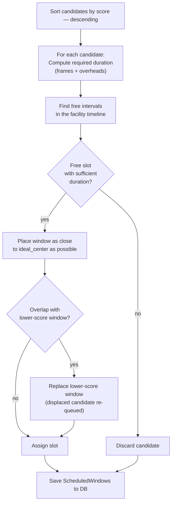

# Allocation Strategies

The allocation strategy takes the scored candidate windows and builds the final schedule without time overlaps.

## Architecture

The abstract base class defines the interface:

```python
class AllocationStrategy:
    def allocate(self, candidates: list[CandidateWindow]) -> list[ScheduledWindow]:
        ...

    def _is_overlapping(self, window, scheduled_windows, current_score) -> bool:
        ...
```

## GreedyAllocationStrategy

The current implementation uses an **optimised greedy algorithm** designed to maximise the total scientific value of the night.

### Algorithm



### Conflict resolution

When two candidates compete for the same time interval, the one with the **higher score** wins. The displaced candidate is not lost: the algorithm attempts to place it in the next available free interval.

### `MIN_BLOCK_MINUTES` parameter

Value: **10 minutes**

Free intervals shorter than 10 minutes are not used. This avoids creating observation blocks too short to be scientifically useful.

### `ideal_center`

When set, the algorithm prefers to place the window centred on this time within the free interval. Useful for transits where the event centre is the scientifically most valuable moment.

## Solution quality

The greedy algorithm does not guarantee a globally optimal solution (that is an NP-hard problem equivalent to the fractional knapsack with temporal constraints), but in practice it produces high-quality results with O(n log n) computational cost — suitable for hundreds of targets per night.

## Extension

To implement an alternative algorithm (e.g. linear programming, simulated annealing):

```python
from scheduler.allocation_strategies.base import AllocationStrategy

class MyAllocationStrategy(AllocationStrategy):
    def allocate(self, candidates):
        # Your algorithm here
        return scheduled_windows
```

Pass the strategy to `SchedulerCore`:

```python
core = SchedulerCore(allocation_strategy=MyAllocationStrategy())
```
