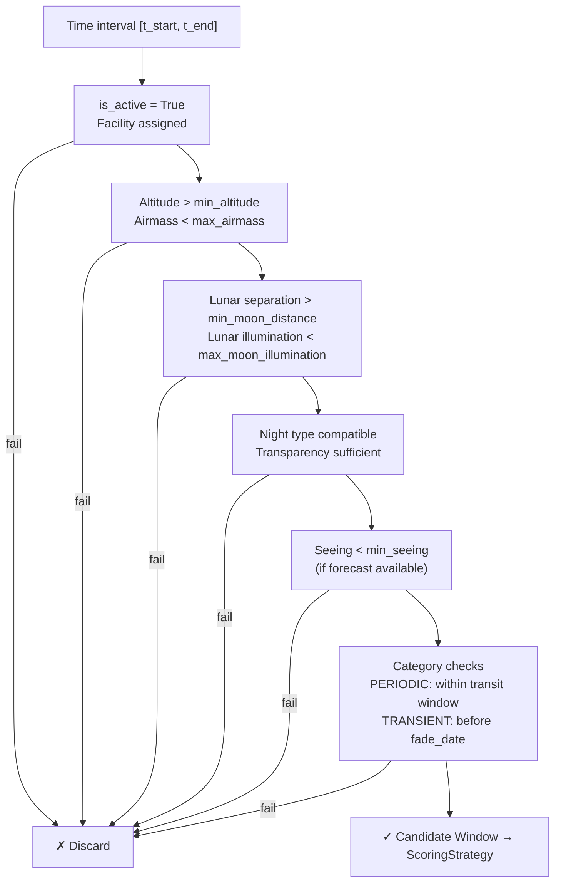

# Constraints Checking

The constraint checking process is the first filter applied by `SchedulerCore` when generating candidate windows. A window that does not pass a constraint is discarded without computing its score.

## Filtering pipeline

For each active profile and each time interval of the night:



## Implementation

The checks are performed inside `SchedulerCore.generate_candidate_windows()`, which iterates over a time grid sampled every N minutes (configurable). For each time sample:

1. `AstronomyEngine.get_target_altaz_coords()` — Computes altitude.
2. `AstronomyEngine.get_airmass()` — Computes airmass.
3. `AstronomyEngine.get_moon_separation()` — Distance to the Moon.
4. `AstronomyEngine.get_moon_phase()` — Lunar illumination.
5. Comparison against the thresholds in `SchedulingProfile`.

## Category-specific constraints

### PERIODIC

Periodic targets are only candidates within their transit window (`transit_start` → `transit_end`). Outside this window, `PeriodicStrategy` returns `0.0` directly:

```python
if time < self.transit_start or time > self.transit_end:
    return 0.0
```

### TRANSIENT

Transient targets have a `fade_date` after which they are no longer candidates:

```python
if time > profile.fade_date:
    return 0.0
```

## Adding custom constraints

To add an extra constraint, extend the `generate_candidate_windows()` method in `SchedulerCore` or create a subclass and override the filtering method. The strategy system also allows integrating custom logic directly inside a scoring function.
