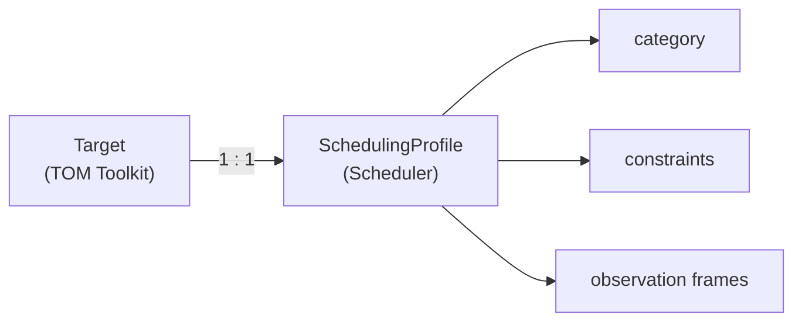

# Extending Targets

TOM Toolkit allows extending the Target model with additional fields and customising target selection logic.

## Extra field: Redshift

This installation adds the `redshift` field to sidereal targets:

```python
# settings.py
EXTRA_FIELDS = [
    {"name": "redshift", "type": "number", "default": 0},
]
```

The field appears in the creation form and in the target detail view. It is stored in the `TargetExtra` table of TOM Toolkit.

## Extension via SchedulingProfile

The `SchedulingProfile` model (in the scheduler module) extends the Target via a `OneToOneField` relationship. This attaches scheduling information without modifying the base TOM Toolkit model.



`SchedulingProfile` creation is triggered automatically when:

- A target is created from an alert (`CreateTargetFromAlertView`).
- The user clicks **Scheduler Config** for the first time on the target page.

## Category inference from alerts

`CreateTargetFromAlertView` extends the standard TOM Toolkit view to infer the scheduling category from broker metadata:

**ALeRCE**: The `lc_classifier_top` parameter from the broker query is mapped to:

| ALeRCE classifier | Scheduler category |
|-------------------|--------------------|
| `SLSN`, `SNIa`, `SNIbc`, `SNII` | TRANSIENT |
| `RRL`, `EB/EW`, `CEP`, `LPV` | PERIODIC |
| `AGN`, `QSO`, `Blazar` | STOCHASTIC |
| Others | STANDARD |

**Other brokers**: `STANDARD` is assigned by default.

## TargetMatcherManager

TOM Toolkit includes `TargetMatcherManager` to avoid duplicates when importing targets. RIA TOM uses the default behaviour: two targets are considered the same if they share the same name or fall within a configurable separation radius.

## Target Groups (TargetList)

Targets can be organised into groups (`TargetList`) for:

- Bulk constraint updates.
- Creating joint observation blocks.
- Filtering the schedule view by project.

Groups are managed from **Targets → Target Groups**.
