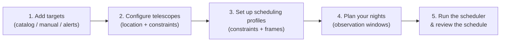

# User Guide

Welcome to the **RIA-TOM** user guide. RIA-TOM is an astronomical observation scheduling platform developed at the Instituto de Astrofísica de Canarias (IAC) for professional observatories. It is designed to make the process of planning observations easy, optimal, and straightforward — replacing hours of manual work with an intelligent, constraint-aware scheduler.

No programming knowledge is required to use this guide.

  <iframe
    src="https://www.youtube.com/embed/9TR43ueHPhI"
    title="RIA-TOM Demo"
    frameborder="0"
    allow="accelerometer; autoplay; clipboard-write; encrypted-media; gyroscope; picture-in-picture; web-share"
    allowfullscreen
    style="position: absolute; top: 0; left: 0; width: 100%; height: 100%;">
  </iframe>

---

## Dashboard

When you first log in, you land on the **Home Page**, which shows the scheduler dashboard at a glance.

### Target counters

On the left side of the dashboard you will find three counters:

| Counter | Description |
|---------|-------------|
| **Total targets** | All targets stored in your database |
| **Scheduled targets** | Targets that have a scheduling profile configured |
| **Active targets** | Staged targets currently enabled for scheduling |

### Moon illumination

On the right side, you can check **tonight's Moon illumination** percentage. This is computed in real time for your observatory's location and is a quick reference before running the scheduler.

### Observatory configuration

Below the counters is the **Observatory Settings** panel. Here you can set:

- **Observatory name** — used for display and logging purposes.
- **Location** (latitude, longitude) — used to fetch weather data and compute local sidereal time.

Once saved, the **weather forecast** panel below will update automatically and show the predicted cloud cover, seeing, and transparency for your site.

!!! tip "Setting your location"
    Make sure to configure your observatory's coordinates before running the scheduler for the first time. The weather forecast and twilight calculations depend on this.

---

## Workflow overview

The typical workflow in RIA-TOM follows five steps:

### Sections in this guide

| Section | What you will learn |
|---------|---------------------|
| [Managing Targets](targets.md) | How to add, import, and organise targets |
| [Configuring Telescopes](telescopes.md) | How to register and set up your telescope(s) |
| [Defining Constraints](constraints.md) | Available observability constraints and observation frames |
| [Observation Planning](planning.md) | Running the scheduler end-to-end |
| [Viewing Schedules](schedules.md) | Interpreting the Gantt chart, visibility curves, and exporting results |
